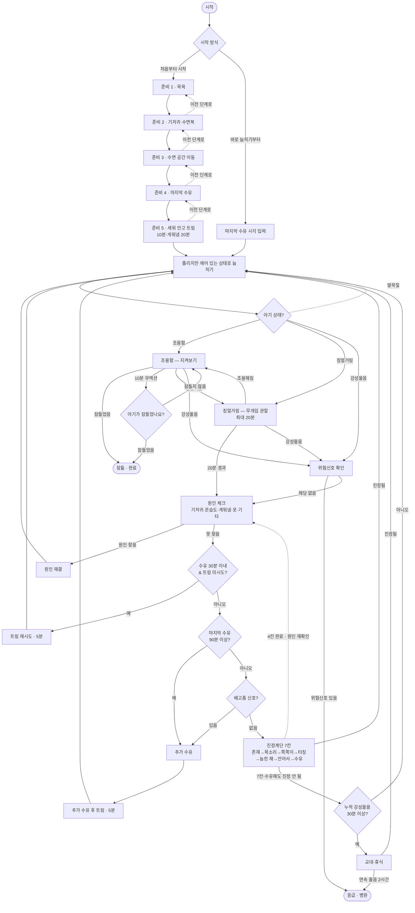

# 수면의식 순서도 (Sleep Routine Flowchart) — v1.3

잠잠(JamJam)이 부모에게 안내하는 재우기 의사결정 흐름이다.
`index.html`의 상태머신(`MACHINE`)과 1:1로 대응하며, 각 분기·타이머 값은
코드의 타이밍 상수(`T`)를 그대로 따른다. 상태 단위의 정밀한 정의는
[상태머신 문서](./state-machine.md)를 참고할 것.

- 대상: 생후 4~12주
- 시간 값: 트림 10분(게워냄이 잦은 아기 20분) · 칭얼거림 무해 한도 20분 ·
  잠듦 확인 주기 10분 · 트림 재시도 5분 · 재수유 게이트(수유 후) 90분 ·
  트림 재시도 게이트(수유 후) 30분 · 진정계단 칸당 2분 · 교대 기준 누적
  강성울음 30분 · 응급 기준 연속 울음 2시간
- 전역 버튼: 활성 상태 어디서나 **[위험신호 확인]**·**[부모 한계]**·**[처음부터]**
  접근 가능 (아래 순서도에는 생략)

## 분기 근거 요약

| 분기 | 조건 | 근거 |
| --- | --- | --- |
| 칭얼거림 → 원인 체크 | 20분 경과 | AAP(미국소아과학회): 잠들기 전 15~20분 울음 무해 |
| 트림 재시도 진입 | 마지막 수유 후 30분 이내 & 세션당 미사용 | 먹은 지 30분 안의 울음은 가스 가능성 |
| 배고픔 → 추가 수유 자동 | 마지막 수유 후 90분 이상 | 재수유 판단 기준 |
| 진정계단 → 교대 | 누적 강성울음 30분 이상 | 부모 소진 방지 |
| 교대 → 응급 | 연속 울음 2시간 | Seattle Children's(미국 시애틀 아동병원) 병원 기준 |
