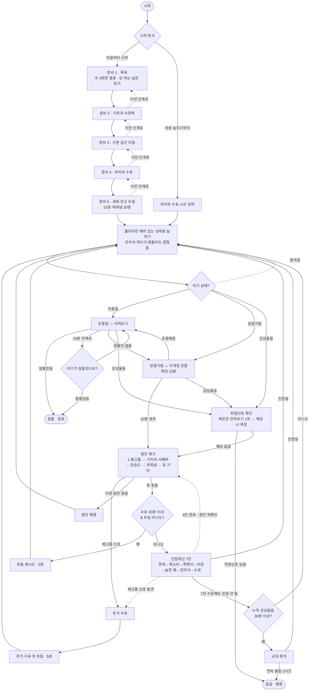

# 수면의식 순서도 (Sleep Routine Flowchart) — v1.4

잠잠(JamJam)이 부모에게 안내하는 재우기 의사결정 흐름이다.
`index.html`의 상태머신(`MACHINE`)과 1:1로 대응하며, 각 분기·타이머 값은
코드의 타이밍 상수(`T`)를 그대로 따른다. 상태 단위의 정밀한 정의는
[상태머신 문서](./state-machine.md)를 참고할 것.

- 대상: 생후 0~12주(3개월 이하) — 수면의식은 언제 시작해도 좋고(Mindell 2015),
  밤낮 리듬이 생기는 생후 6주 무렵부터 효과 체감(Rivkees 2003·Karitane)
- 시간 값: 트림 10분(게워냄이 잦은 아기 20분) · 칭얼거림 관찰 한도 10분 ·
  잠듦 확인 주기 10분 · 트림 재시도 5분 · 재수유 힌트(수유 후) 90분 ·
  트림 재시도 게이트(수유 후) 30분 · 진정계단 칸당 1~2분(격한 울음 시 즉시
  격상) · 교대 기준 누적 강성울음 30분 · 응급 기준 연속 울음 2시간(5분 미만
  소강은 같은 에피소드)
- 전역 버튼: 활성 상태 어디서나 **[위험신호 확인]**·**[부모 한계]**·**[처음부터]**
  접근 가능 (아래 순서도에는 생략)
- 전역 규칙: 연속 울음 2시간 도달 시 **어느 상태에서든** 응급 안내로 자동 전환
  (우는 중일 때만 발동 — 소강 중에는 재개 시 즉시)

## 분기 근거 요약

| 분기 | 조건 | 근거 |
| --- | --- | --- |
| 칭얼거림 → 원인 체크 | 10분 경과 | 대한소아청소년과학회: 눕힌 뒤 10~20분 칭얼거림은 정상 — 하한을 보수적으로 채택 |
| 원인 체크 1번 = 배고픔 | 루팅·손 빨기·입 오물거림 | NHS·Mayo·KidsHealth 울음 체크리스트 표준 순서 (울음은 배고픔의 늦은 신호) |
| 위험신호 체온 | 촉진 1차 → 측정 2차 (발열 38.0°C↑ / 저체온 36.0°C↓ 재가온 후 재측정) | NHS·Seattle Children's — 뜨겁게 느껴질 때 측정, 저체온은 보온에도 안 오르면 진료 |
| 트림 재시도 진입 | 마지막 수유 후 30분 이내 & 세션당 미사용 | 먹은 지 30분 안의 울음은 가스 가능성 |
| 수유 90분 힌트 | 마지막 수유 후 90분 이상 | 배고픔 가능성 높음 안내 (게이트 아님 — 신호가 있으면 언제든 수유) |
| 진정계단 → 수유 탈출 | 배고픔 신호 발견 시 어느 칸에서든 | UNICEF Baby Friendly 반응 수유 |
| 진정계단 → 교대 | 누적 강성울음 30분 이상 | 부모 소진 방지 |
| 어느 상태든 → 응급 | 연속 울음 2시간 (5분 미만 소강 유예) | Seattle Children's(미국 시애틀 아동병원) 병원 기준 |
