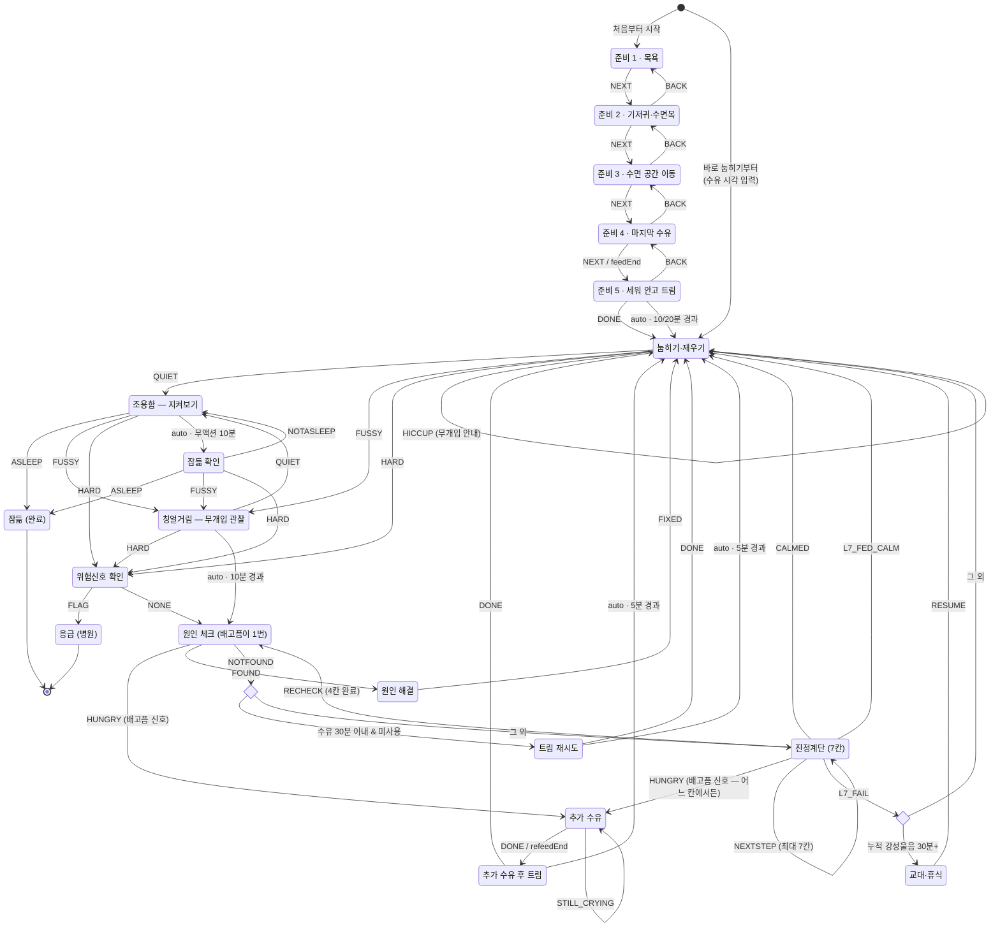

# 상태머신 (State Machine) — v1.4

`index.html`의 `MACHINE` 정의를 그대로 옮긴 상태 다이어그램이다. 화면(UI)은
이 상태머신을 렌더링한 결과이며, 상태 id는 코드의 상태 이름과 동일하다.
사람이 보는 재우기 흐름은 [순서도 문서](./sleep-routine-flowchart.md)를
참고할 것.

## 타이밍 상수 (코드 `T` 1:1)

| 상수 | 값 | 용도 |
| --- | --- | --- |
| `UPRIGHT_BURP` / `UPRIGHT_BURP_SPITTY` | 10분 / 20분 | 수유 후 세워 안기 — AAP·KidsHealth '10~15분'의 하단 / 게워냄이 잦으면 AAP '최소 20분' |
| `SLEEP_ASK` | 10분 | 조용 상태 무액션 시 잠듦 확인 질문 주기 |
| `FUSSING_LIMIT` | 10분 | 칭얼거림 관찰 한도 → 원인 체크 전환 (대한소아청소년과학회 '10~20분 정상 범위'의 하한) |
| `BURP_RETRY` | 5분 | 트림 재시도 |
| `BURP_GATE` | 30분 | 트림 재시도 진입 게이트 (마지막 수유 후) |
| `REFEED_BURP` | 5분 | 추가 수유 후 짧은 트림 — 앱 절충값 (트림 시도는 1~2분이면 충분(NHS), 밤중 전용 기관 수치는 없음) |
| `REFEED_GATE` | 90분 | '배고픔 가능성 높음' 힌트 기준 (게이트 아님 — 신호가 있으면 언제든 수유) |
| `LADDER_STEP` | 1분 | 진정계단 다음 칸 힌트 (1~2분 관찰 — 기관 권고 '기법당 수 분'의 하한, 격한 울음 시 즉시 격상) |
| `HARD_CRY_LIMIT` | 30분 | 누적 강성울음 교대 기준 |
| `NONSTOP_WARN` / `NONSTOP_EMERGENCY` | 90분 / 120분 | 연속 울음 경고 / 응급 병원 기준 |
| `NONSTOP_GRACE` | 5분 | 연속 울음 소강 유예 — 5분 미만의 잠잠은 같은 에피소드 |

## 다이어그램

- `<<choice>>`: 컨텍스트로 목표 상태를 결정하는 의사상태 (코드의 `resolve*`/게이트 함수)
- 점선(`-->`에 조건 라벨): `auto` 자동 전이 (타이머 경과 시 자동 전환)
- 실선: `on` 이벤트 전이 (부모의 버튼 입력)

## 전역 전이 (모든 활성 상태 공통)

- **연속 울음 2시간** → `emergency` 자동 전이. 어느 상태에서든 발동하되,
  실제로 우는 중일 때만 (소강 중에는 재개하는 순간 즉시 발동). 5분 미만의
  소강은 연속 울음을 리셋하지 않는다 (`NONSTOP_GRACE`).
- **[위험신호 확인]** → `redflag` 오버레이 → 위험신호 선택 시 `emergency`.
  체온은 촉진(만져보기) 1차 → 해당 시에만 측정 2차 (발열 38.0°C↑ 해열제 금지
  경고 / 저체온 36.0°C↓ 재가온 후 재측정).
- **[부모 한계]** → 안전히 눕힘 확인 → `handoff`
- **[⟲ 처음부터]** → 확인 후 세션 삭제, 시작 화면으로

## 강성울음 집계 전이

준비·처치 단계(`bath`·`dress`·`move`·`feed`·`burp`·`burpretry`·`fixing`)에서는
울음 시작/종료를 별도 이벤트로 집계한다 (상태 전이 없음).

- `CRY_HARD_START` → 강성울음 집계 시작
- `CRY_STOPPED` → 집계 종료

## choice 의사상태 (코드 1:1)

- **BurpGate** (`burpRetryEligible`): `!burpRetryUsed && (수유 시각 미상 || 마지막
  수유 후 30분 이내)`이면 `burpretry`, 아니면 `ladder`. (배고픔은 원인 체크
  1번에서 이미 확인 — 배고픔 게이트는 v1.4에서 폐지)
- **LimitGate** (`resolveLimitGate`): 누적 강성울음 30분 이상이면 `handoff`,
  아니면 `settling`.

## 최종 상태

- `asleep`: 잠듦 확정. 잠든 시각은 조용해지기 시작한 시각으로 소급 기록,
  누적 강성울음 리셋 후 세션 요약 표시.
- `emergency`: 응급. 선택된 위험신호와 119 안내 표시.
